# Architecture TOGAF - Good Food 3.0

## Vue d'ensemble
Ce document présente l'architecture d'entreprise de Good Food selon le framework TOGAF (The Open Group Architecture Framework).

---

## 1. Architecture Métier (Business Architecture)

### 1.1 Cartographie des Acteurs et Processus Métier

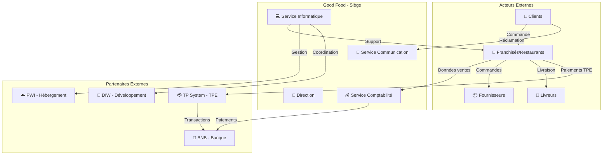

### 1.2 Processus Métier Principaux

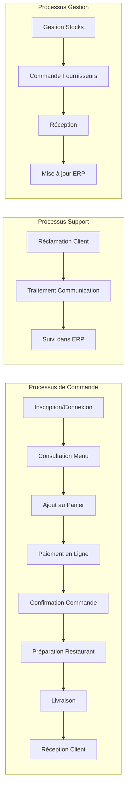

---

## 2. Architecture Applicative (Application Architecture)

### 2.1 Vue de la Couche Applicative du SI Actuel (AS-IS)

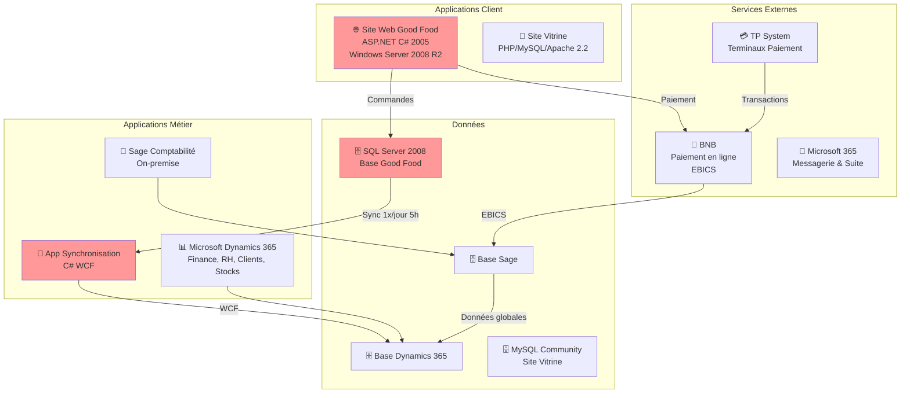

### 2.2 Architecture Applicative Cible (TO-BE)

```mermaid
graph TB
    subgraph "Canaux Client"
        WEBAPP[📱 Application Web<br/>Progressive Web App]
        MOBILE[📱 Application Mobile<br/>iOS/Android Hybride]
        VITRINE2[📄 Site Vitrine<br/>Modernisé]
    end
    
    subgraph "API Gateway & Sécurité"
        GATEWAY[🚪 API Gateway<br/>Authentification/Autorisation<br/>Rate Limiting]
    end
    
    subgraph "Microservices Métier"
        AUTH[🔐 Service Authentification<br/>JWT/OAuth2]
        USER[👤 Service Clients<br/>Gestion comptes]
        MENU[🍽️ Service Menus<br/>Catalogue produits]
        ORDER[🛒 Service Commandes<br/>Panier & Commandes]
        PAYMENT[💳 Service Paiement<br/>Transactions]
        DELIVERY[🚚 Service Livraison<br/>Organisation livraisons]
        BOOKING[📅 Service Réservations]
        FRANCHISE[🏪 Service Franchisés<br/>Gestion & Promotions]
        ANALYTICS[📊 Service Analytics<br/>Aide à la décision]
        NOTIF[🔔 Service Notifications<br/>Email/Push/SMS]
    end
    
    subgraph "Intégrations"
        ERPINT[🔗 Connecteur ERP<br/>Dynamics 365]
        SAGEINT[🔗 Connecteur Sage]
        TPEINT[🔗 Connecteur TPE]
        BANKINT[🔗 Connecteur Bancaire<br/>EBICS]
    end
    
    subgraph "Données"
        MAINDB[(🗄️ Base Principale<br/>PostgreSQL/MySQL)]
        CACHEDB[(⚡ Cache Redis)]
        DWH[(📊 Data Warehouse<br/>Analytics)]
    end
    
    subgraph "Systèmes Externes"
        ERP2[📊 Dynamics 365]
        SAGE2[💼 Sage]
        TPE2[💳 TP System]
        BANK2[🏦 BNB]
    end
    
    WEBAPP --> GATEWAY
    MOBILE --> GATEWAY
    
    GATEWAY --> AUTH
    GATEWAY --> USER
    GATEWAY --> MENU
    GATEWAY --> ORDER
    GATEWAY --> PAYMENT
    GATEWAY --> DELIVERY
    GATEWAY --> BOOKING
    GATEWAY --> FRANCHISE
    GATEWAY --> ANALYTICS
    
    AUTH --> MAINDB
    USER --> MAINDB
    MENU --> MAINDB
    ORDER --> MAINDB
    PAYMENT --> MAINDB
    DELIVERY --> MAINDB
    BOOKING --> MAINDB
    FRANCHISE --> MAINDB
    
    ORDER --> CACHEDB
    MENU --> CACHEDB
    
    ANALYTICS --> DWH
    USER --> DWH
    ORDER --> DWH
    
    PAYMENT --> NOTIF
    ORDER --> NOTIF
    DELIVERY --> NOTIF
    
    ORDER --> ERPINT
    USER --> ERPINT
    ERPINT --> ERP2
    
    PAYMENT --> SAGEINT
    SAGEINT --> SAGE2
    
    PAYMENT --> TPEINT
    TPEINT --> TPE2
    
    PAYMENT --> BANKINT
    BANKINT --> BANK2
    
    style GATEWAY fill:#90EE90
    style MAINDB fill:#87CEEB
    style CACHEDB fill:#FFD700
```

---

## 3. Architecture des Composants Logiques

### 3.1 Décomposition en Composants Métier (Architecture Logique)

```mermaid
graph TB
    subgraph "Couche Présentation"
        UI_WEB[Interface Web]
        UI_MOBILE[Interface Mobile]
        UI_ADMIN[Interface Admin Franchisés]
    end
    
    subgraph "Couche API & Orchestration"
        API_GATEWAY[API Gateway]
        ORCHESTRATOR[Orchestrateur de Services]
    end
    
    subgraph "Couche Services Métier"
        subgraph "Gestion Client"
            COMP_AUTH[Authentification<br/>& Autorisation]
            COMP_USER[Gestion Profils<br/>Clients]
            COMP_RECLA[Gestion<br/>Réclamations]
        end
        
        subgraph "Gestion Catalogue"
            COMP_MENU[Gestion Menus]
            COMP_PROMO[Gestion Promotions]
            COMP_PRIX[Gestion Tarifs]
        end
        
        subgraph "Gestion Commandes"
            COMP_CART[Panier]
            COMP_ORDER[Commandes]
            COMP_TRACK[Suivi Commandes]
        end
        
        subgraph "Gestion Paiement"
            COMP_PAY[Traitement<br/>Paiement]
            COMP_REFUND[Remboursements]
        end
        
        subgraph "Gestion Livraison"
            COMP_DELIV[Organisation<br/>Livraisons]
            COMP_ROUTE[Optimisation<br/>Tournées]
            COMP_TRACK_DELIV[Suivi Temps Réel]
        end
        
        subgraph "Gestion Franchisés"
            COMP_RESTO[Gestion<br/>Restaurants]
            COMP_STOCK[Gestion Stocks]
            COMP_FOURNISS[Gestion<br/>Fournisseurs]
        end
        
        subgraph "Services Transverses"
            COMP_NOTIF[Notifications]
            COMP_ANALYTICS[Analytics &<br/>Reporting]
            COMP_SEARCH[Recherche]
        end
    end
    
    subgraph "Couche Intégration"
        INT_ERP[Intégration ERP]
        INT_COMPTA[Intégration Comptabilité]
        INT_BANK[Intégration Bancaire]
        INT_TPE[Intégration TPE]
    end
    
    subgraph "Couche Données"
        DATA_TRANS[Données<br/>Transactionnelles]
        DATA_REF[Données<br/>Référentielles]
        DATA_ANAL[Données<br/>Analytiques]
    end
    
    UI_WEB --> API_GATEWAY
    UI_MOBILE --> API_GATEWAY
    UI_ADMIN --> API_GATEWAY
    
    API_GATEWAY --> ORCHESTRATOR
    
    ORCHESTRATOR --> COMP_AUTH
    ORCHESTRATOR --> COMP_USER
    ORCHESTRATOR --> COMP_MENU
    ORCHESTRATOR --> COMP_CART
    ORCHESTRATOR --> COMP_ORDER
    ORCHESTRATOR --> COMP_PAY
    ORCHESTRATOR --> COMP_DELIV
    ORCHESTRATOR --> COMP_RESTO
    
    COMP_ORDER --> COMP_NOTIF
    COMP_PAY --> COMP_NOTIF
    COMP_DELIV --> COMP_NOTIF
    
    COMP_ORDER --> INT_ERP
    COMP_USER --> INT_ERP
    COMP_PAY --> INT_COMPTA
    COMP_PAY --> INT_BANK
    COMP_PAY --> INT_TPE
    
    COMP_USER --> DATA_TRANS
    COMP_ORDER --> DATA_TRANS
    COMP_MENU --> DATA_REF
    COMP_ANALYTICS --> DATA_ANAL
```

---

## 4. Architecture de Données

### 4.1 Modèle de Données Conceptuel

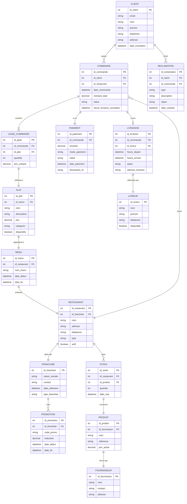

---

## 5. Architecture Technologique

### 5.1 Infrastructure Cible (TO-BE)

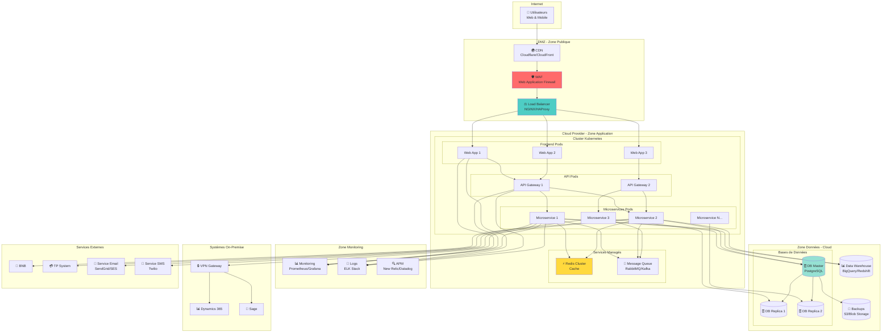

### 5.2 Stack Technologique Recommandée

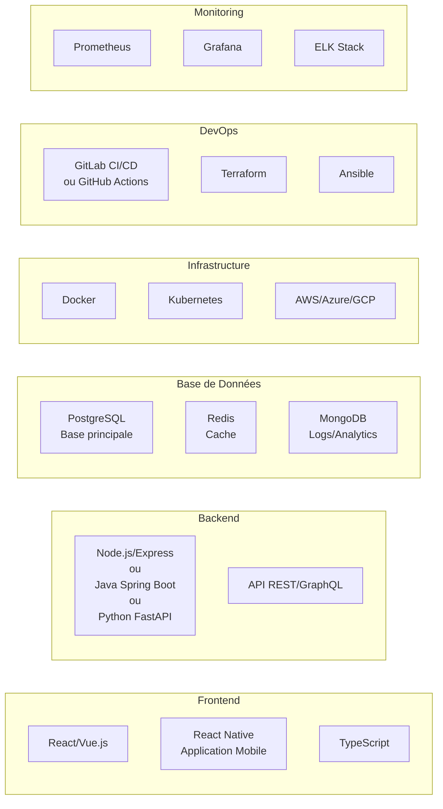

---

## 6. Flux de Données Principaux

### 6.1 Flux de Commande

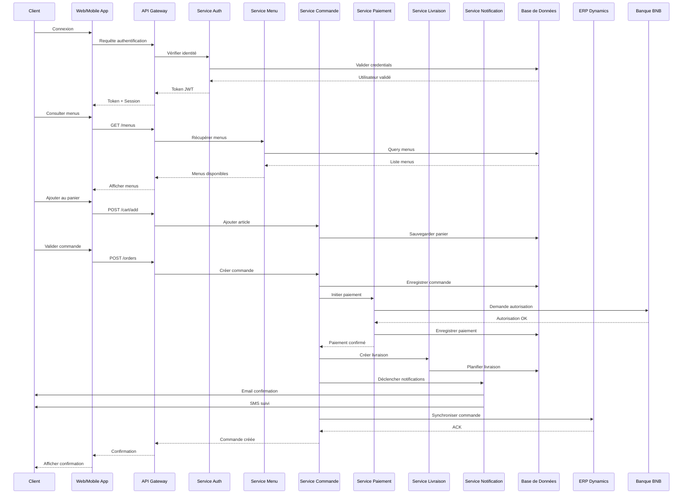

### 6.2 Flux de Synchronisation avec l'ERP

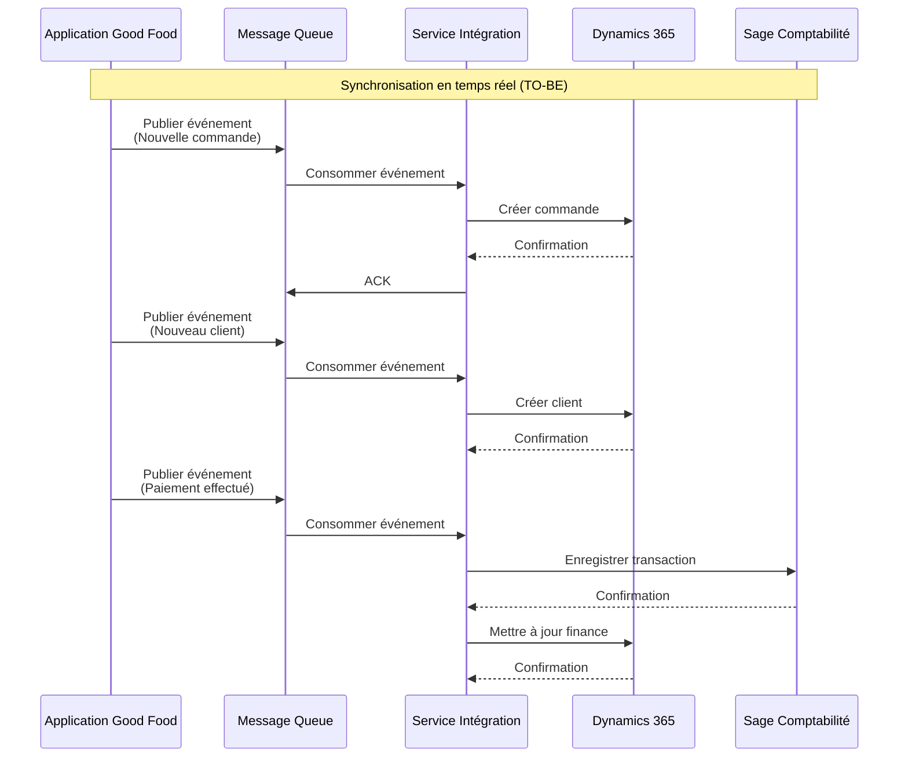

---

## 7. Matrice de Comparaison des Styles d'Architecture

### 7.1 Évaluation des Styles Architecturaux

| Style d'Architecture | Performance | Scalabilité | Maintenabilité | Évolutivité | Complexité | Coût | Score Total |
|---------------------|-------------|-------------|----------------|-------------|------------|------|-------------|
| **Monolithique** | 4/5 | 2/5 | 2/5 | 2/5 | 2/5 | 5/5 | 17/30 ❌ |
| **Architecture en Couches** | 3/5 | 3/5 | 3/5 | 3/5 | 3/5 | 4/5 | 19/30 |
| **SOA (Service-Oriented)** | 3/5 | 4/5 | 4/5 | 4/5 | 3/5 | 3/5 | 21/30 |
| **Microservices** | 4/5 | 5/5 | 5/5 | 5/5 | 2/5 | 2/5 | 23/30 ✅ |
| **Architecture Hexagonale** | 4/5 | 4/5 | 5/5 | 5/5 | 3/5 | 3/5 | 24/30 ✅ |
| **Event-Driven** | 5/5 | 5/5 | 4/5 | 5/5 | 2/5 | 2/5 | 23/30 ✅ |

**Recommandation** : Architecture Microservices avec approche Hexagonale et patterns Event-Driven

---

## 8. Roadmap de Migration

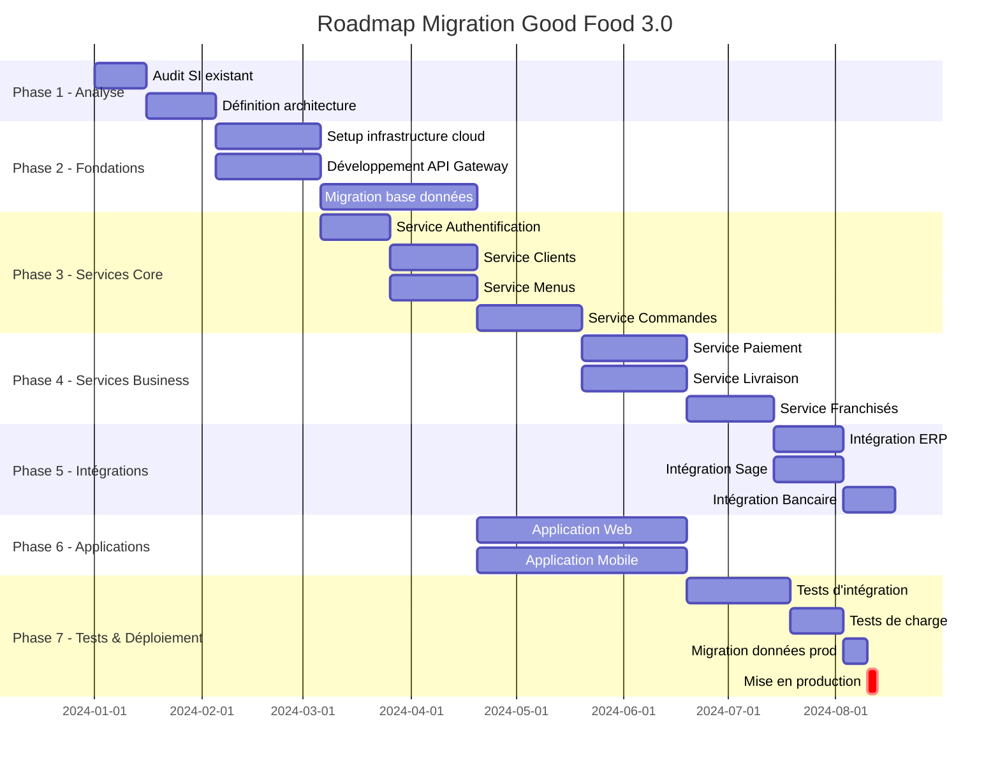

---

*Document créé pour le projet Good Food 3.0*
*Framework: TOGAF*
*Version: 1.0*

